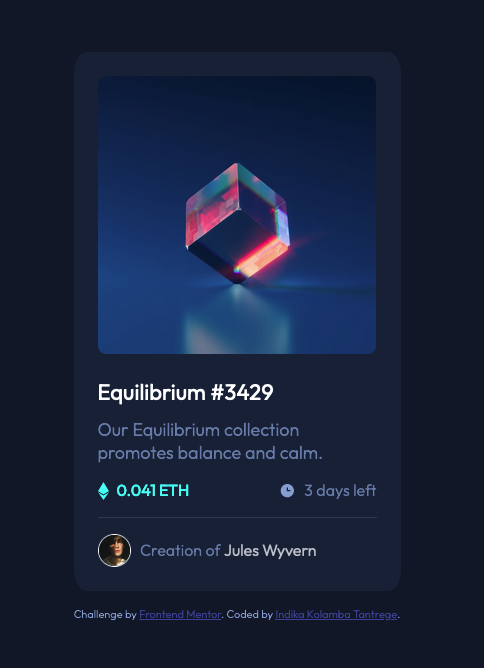
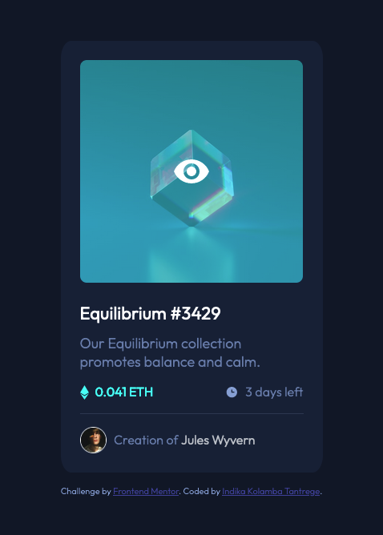

# Frontend Mentor - NFT preview card component solution

This is a solution to the [NFT preview card component challenge on Frontend Mentor](https://www.frontendmentor.io/challenges/nft-preview-card-component-SbdUL_w0U). Frontend Mentor challenges help you improve your coding skills by building realistic projects. 

## Table of contents

- [Overview](#overview)
  - [The challenge](#the-challenge)
  - [Screenshot](#screenshot)
  - [Links](#links)
- [My process](#my-process)
  - [Built with](#built-with)
  - [What I learned](#what-i-learned)
  - [Continued development](#continued-development)
  - [Useful resources](#useful-resources)
- [Author](#author)

## Overview

### The challenge

Users should be able to:

- View the optimal layout depending on their device's screen size
- See hover states for interactive elements

### Screenshot




### Links

- [Solution URL](https://github.com/iamindika/nft-preview-card-component-main/tree/main/src)
- [Live Site URL](https://hardcore-lamarr-b9515d.netlify.app/)

## My process

### Built with

- Semantic HTML5 markup
- CSS with BEM naming conventions
- Flexbox
- [React](https://reactjs.org/) - JS library
- webpack

### What I learned

I learnt about html landmarks and writing a more semantic markup.  I learnt how to create a react project from the ground up using react and a module bundler (webpack). I also learnt how to overlay one image over another using css (highlighted below). 

```css
.nft-banner {
  position: relative;
  width: 278px;
  height: 278px;
}

.nft-banner:hover .nft-banner__view-bg,
.nft-banner:hover .nft-banner__view-icon {
  opacity: 1;
}

.nft-banner__view-bg {
  transition: .5s ease;
  opacity: 0;
  position: absolute;
  top: 0;
  left: 0;
  width: 100%;
  height: 100%;
  border-radius: 3%;
  background: hsla(178, 100%, 50%, .5);
}

.nft-banner__view-icon {
  opacity: 0;
  position: absolute;
  top: 50%;
  left: 50%;
  transform: translate(-50%, -50%);
}
```

### Continued development

I want to continue improving my semantic markup, css, and react applications. I also want to attempt using styled components instead of a single style sheet in future projects. 

### Useful resources

- [w3schools](https://www.w3schools.com/howto/howto_css_image_overlay.asp) - This helped me understand and play with the concepts of how to overlay one image over another.  Does require a small bit of prior knowledge of some css properties, otherwise it is a very elegant solution. 

## Author

- Frontend Mentor - [@iamindika](https://www.frontendmentor.io/profile/iamindika)
- Twitter - [@1am1nd1ka](https://twitter.com/1am1nd1ka)